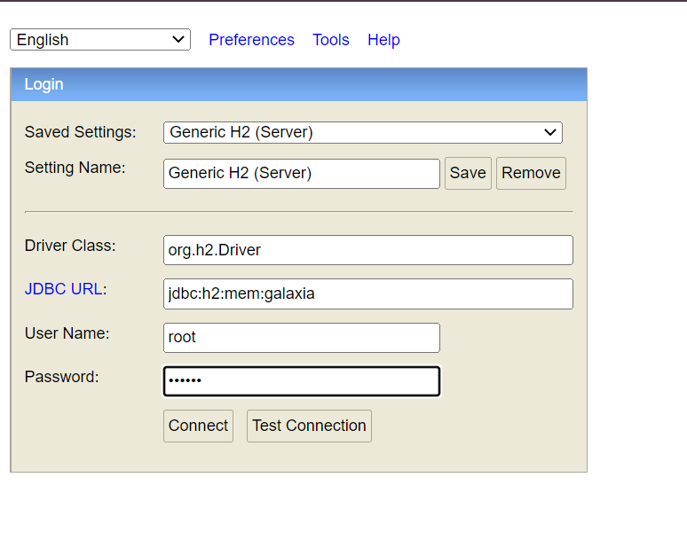

# Galaxia-Connect

## Introduction
The name combines "Galaxia", a word derived from the Greek word for galaxy, and "Connect" to indicate the ability to communicate and engage with others.
Galaxia Connect means this program is designed to connect people interested in learning about the universe in an interactive way. The software could offer features such as forums, chat rooms, educational resources, and interactive tools to enhance the learning experience. The platform could foster collaboration and encourage meaningful discussions about various aspects of the universe, from space exploration and astrophysics to the cultural and philosophical aspects of our relationship with the cosmos.

## Prerequisites
1. JDK 17
2. Node 18 (Galaxy educational demo backend).
3. Python 3.6
4. Redis for caching(Without Redis, the program cannot run properly.
   For more information about how to get started on redis, please refer to [link](https://tableplus.com/blog/2018/10/how-to-start-stop-restart-redis.html).
   If you are using Windows, you are suggested to download Redis-x64-5.0.14.1.msi from [link](https://github.com/tporadowski/redis/releases)
   and add redis folder to the PATH environment variables accordingly. (If you find any bugs with related to redis in the console
   after running the program, it indicates that you didn't configure Redis properly). )
5. MongoDB.


## Steps to set up this project
1. **Clone the application**

   ```bash
   git clone https://github.com/RepublicHo/Galaxia-Connect
   ```
+ clone the front-end, please refer to [Link](https://github.com/lucascheng24/galaxia-interface)
+ clone the forum, please refer to [Link](https://github.com/lucascheng24/COMP3334-Discussion-forum)

2. Connecting MongoDB requires the python package "pymongo". Run 
 ```bash
   pip install pymongo
   ```
   to install the package if you have not done so.
 
3. **This step is not necessary when you run the code since by default no password needed. You can configure Redis password if needed in the future.**

    + open `src/main/resources/application.yaml` file.

    + change `spring.redis.password` properties as per your redis.conf file. 

4. **Run the app**

   You can run the spring boot app by typing the following command -
   Server (Intellij is suggested):

   ```bash
   mvn spring-boot:run
   ```   
   
   Client:
   ```bash
   npm install (in the react-client folder)
   npm start
   ```

   Run the server first then the client.
   The client will start on port 3000. 
   The server will start on port 8080.


## Database 

You can check user information at H2 database (http://localhost:8080/api/h2-console) 
Login with username:root and password 123456. The user information will be storing in MongoDB as well. 




## Reference:

1. Universe demo. [Link](https://github.com/KikiLetGo/UniverseSim)


